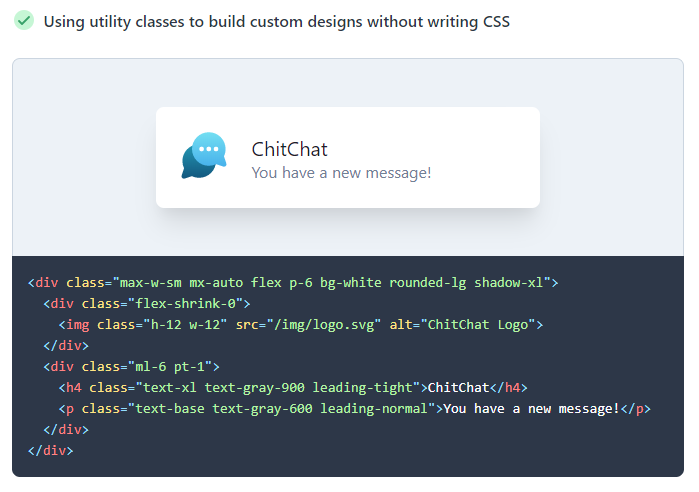

Keeping your CSS manageable is a tricky problem to solve, utility first frameworks are the answer, find out why!

<!-- end -->

When working on a web project, the approach you take to manage your CSS is critically important, even more so as the project grows.

I recently moved several projects of different sizes over to using [TailwindCSS](https://tailwindcss.com/), this post explains what I found and why I think you should try a utility first framework.

## What's the problem?

Styling web projects is difficult; with the advent of Single Page Applications (SPAs) more complexity typically ends up on the client-side and how styles are written, where they are put and how they are applied catch many people out.
From experience, the problems associated with a scaled web application can be grouped into three categories:

- Where you put the CSS
- How you write the CSS
- Understanding the CSS

### Where to put the CSS

There are broadly speaking two schools of thought here, CSS in the same file as the HTML or CSS separately.

Many years ago the preference was to separate inline styles from HTML to avoid mixing concerns (styling and structure), this solved that problem but introduced another in the form of context switching.

Component-based libraries like React and Vue promote small reusable components. More components mean more potential locations for CSS and finding it and working out what applies in what order is timing consuming.

The best approach here in my mind is to have a predictable location for the CSS relative to HTML and not have to spend time working out how it will be applied.

### How to write the CSS

CSS pre-processors such as SASS/LESS allow variables, mixins and basic control structures such as loops which can reduce duplication and allow customisation such as theming.

Pre-processors solve some problems when writing CSS, reducing duplication etc but don't fix the issue of where to put CSS. Pre-processors can make it harder to work out what's happening as you can't always understand what CSS will be generated without understanding all the pre-processor code, and how it will be applied which again takes up more time. _(In the past I've even seen developers spend hours amending the generated CSS only to have it overwritten when the pre-processor is run again)_

[Styled Components](https://styled-components.com/) take a different approach, effectively turning CSS into a Javascript string template. You can use variables, mixins and control logic and your CSS becomes part of your component code.
They partially solve the problem of where to put your CSS by co-locating it with your Javascript, but the decision regarding whether to put a component in the same file or separate files still exists.

### Understanding the CSS

CSS is an interesting language and one area where I believe people come unstuck is understanding how the CSS they write will be applied to elements. On top of the technical aspects of [Specificity](https://developer.mozilla.org/en-US/docs/Web/CSS/Specificity) styles are applied in an order and override each other based on this, add automation, pre-processors and unpredictable file locations into this mix and it can be tricky to understand what actual source code locations contributed to a given style.

Styling approaches such as [Block Element Modifier](http://getbem.com/) (BEM), [CSS Modules](https://github.com/css-modules/css-modules) and Styled Components have ways to help with the problem of naming collisions in different ways. BEM uses a naming convention methodology, CSS Modules use auto-generated non-conflicting class names and Styled Components by generating inline styles from JS code. //TODO: Check this

Whilst these approaches work, often the code which comes out is hard to reason with. This is the output in the browser from styled components for example:

`<header class="sc-eqIVtm giGlc"></header>`

The best approach here would be for naming collisions and accidental overrides to simply not happen and if they do for it to be simple to understand why.

## What is a utility-first framework?

A utility-first framework is a way to provide CSS utility classes such as `rounded`, `bg-blue` or `md:w-1/2` which you can simply add directly yo your HTML. The classes translate into CSS properties, so `rounded` might equate to `border-radius: 0.5rem;` or `bg-blue` to `background-color: blue;` so that you have to write literally zero CSS.

### But that's just inline styles!

It's not, trust me! whilst it _looks_ a bit like inline styles, what you're doing is applying a known set of defined values which helps you achieve consistency.

I cannot emphasise the benefit of having a pre-set range of values for spacing, colours etc enough. When you couple this with the [VS Code Plugin](https://marketplace.visualstudio.com/items?itemName=bradlc.vscode-tailwindcss) from Brad Cornes and you're writing CSS with intellisense.

Tailwind has a great [summary of a utility-first workflow](https://tailwindcss.com/docs/utility-first/) which I would suggest reading to fully understand the approach.

## How does Tailwind solve our problems?

Tailwind addresses where we put our CSS by asking us to write class names directly onto our HTML, this solves our context switching issue.

Tailwind solves how we write our CSS by saying...you don't need to write any CSS, use ours. You will find cases where you want to extend the tailwind classes and the odd occasion where you might need to do something with pseudo selectors but by and large, you will not need to write CSS directly, you will compose your components from Tailwind styles.

TailwindCSS ensures naming collisions are a non-issue, by reducing CSS selector specificity. If you do accidentally apply the same style twice, it will literally be on the same line so finding issues is quick and painless.

## The benefits

### You're not writing CSS or naming CSS classes.

Just think about this for a second, you're styling your application...without writing CSS or having to spend time creating, refactoring and maintaining naming schemes.

### Configurable

You control the values through a simple config file, easily adapt this to a style guide/design system. As a designer this is hugely powerful, you control the values the developers use and can amend them quickly and painlessly.

### Responsive out of the box

You can simply apply classes prefixed with `sm:`, `md:` and `lg:` with pre-set breakpoints, don't like the breakpoints? re-configure them in a simple file.

### Reasonable

It's quite simple to inspect an HTML element in the browser, see the actual CSS class which is applied and understand where it came from because the class names in tailwind in your dev environment are the same as in the browser, no abstraction, no re-direction...just a CSS class...made with...you know, CSS.

## The downsides

### Lengthy `className` definitions

Complex elements can end up with a long list of classes. This can look a bit messy but isn't a major problem in my opinion. There are some solutions to this, such as using the [@apply](https://tailwindcss.com/docs/extracting-components/) directive, but I'd advise avoiding this until you feel it becomes a problem for your team.

### Inability to define complex selectors

Tailwind deliberately doesn't provide every possible combination. If you want to do fancy stuff like target the child of an element with a particular attribute you can't do that. Then again you should probably consider if and why you need to do that and if there is a better way.

## Summary

Tailwind for me is a revelation, I looked at it previously and discounted it as being inline styles, It's not. It's hard to explain in words exactly how liberating it is as a developer to have a toolbox to pick from rather than having to handcraft every little detail and you have to try it to understand it, but if you're working on a front-end project, or are part of a team which is struggling for consistency, scalability and the ability to respond quickly to design changes, you need to give it a go, it will change your life!
